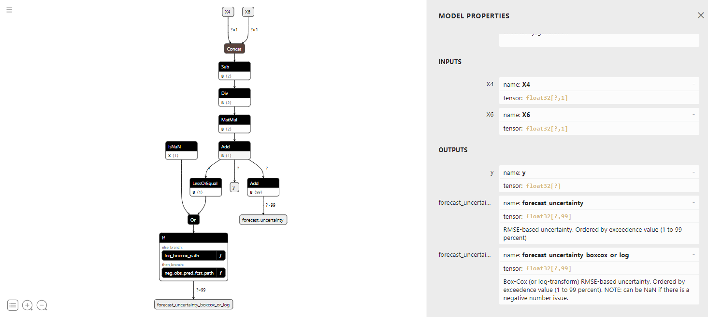

# Getting Started

## Installation
To install Zepyhr, first you should download or clone the [github repository](https://github.com/kevinfol/Zephyr).

Zephyr uses [Python 3.11](https://www.python.org/downloads/release/python-31112/) along with a number of python 
packages in order to operate. Once Python is installed on your system you can install the python requirements
by navigating to the Zephyr directory (i.e. the directory containing the 'readme.md' file) and running the command:  

`pip install -r requirements.txt`

To test whether the installation was successful, navigate to the Zephyr directory (i.e. the directory containing the 'readme.md' file) and run the command:  

`python cli/test_install.py`

Resolve any errors that arise before continuing.

## A basic example
The following example will create a simple multiple-linear-regression model using 
an input data file and a simple input pipeline. 

Begin by navigating to the Zephyr directory (i.e. the directory containing the 'readme.md' file). 

### Create an input data file
Copy the following data into a text file named **input_data.csv**.  

    Year,   Target,  X1,  X2,  X3,  X4,  X5, X6, X7, X8  
    1991,   532195.04,	28.3,	23.5,	27.7,	31.5,	19.4,	23.4,	24.4,	26.0
    1992,	355053.22,	20.1,	17.8,	20.7,	25.5,	17.9,	18.7,	16.8,	20.9
    1993,	426414.55,	22.2,	19.3,	24.4,	27.0,	20.2,	23.1,	25.1,	25.8
    1994,	279475.04,	18.3,	17.0,	18.2,	25.0,	17.4,	20.0,	15.4,	19.6
    1995,	499999.33,	32.9,	27.9,	32.9,	35.3,	23.4,	28.3,	30.6,	31.5
    1996,	689464.47,	39.0,	33.9,	44.3,	45.5,	24.9,	31.8,	27.7,	34.5
    1997,	741131.90,	42.8,	33.2,	45.2,	45.1,	26.7,	36.8,	32.2,	36.5
    1998,	426291.57,	21.9,	20.0,	22.6,	25.7,	16.8,	19.1,	16.3,	22.7
    1999,	538928.93,	35.2,	28.6,	37.2,	39.3,	24.9,	27.6,	25.4,	31.2
    2000,	356517.03,	19.2,	19.2,	22.4,	27.2,	19.6,	17.9,	16.3,	23.8
    2001,	256920.99,	17.4,	17.0,	15.9,	22.3,	16.2,	15.9,	14.8,	21.4
    2002,	392602.31,	25.5,	23.2,	27.3,	28.4,	19.9,	23.5,	20.7,	25.9
    2003,	441905.46,	28.7,	25.0,	31.7,	35.4,	23.0,	27.9,	21.1,	26.6
    2004,	260156.03,	19.5,	19.4,	19.1,	26.4,	15.7,	15.6,	7.50,	20.5
    2005,	341754.05,	16.9,	16.4,	18.0,	22.1,	14.8,	17.0,	11.8,	18.9
    2006,	399229.09,	24.4,	22.9,	25.3,	30.8,	19.8,	21.4,	17.5,	26.4
    2007,	279824.13,	21.9,	22.3,	21.2,	29.9,	20.9,	18.9,	14.2,	24.4
    2008,	648198.35,	29.3,	27.1,	33.6,	38.1,	27.1,	31.7,	22.2,	29.8
    2009,	595406.28,	29.9,	27.5,	32.1,	35.8,	22.5,	32.0,	21.9,	27.7
    2010,	422215.54,	19.6,	22.5,	18.7,	23.6,	15.1,	19.1,	12.5,	20.4
    2011,	742962.65,	36.7,	34.6,	41.5,	44.3,	34.1,	38.3,	33.2,	36.7
    2012,	388361.66,	25.3,	27.5,	30.0,	36.8,	26.9,	24.0,	14.7,	29.6
    2013,	414027.76,	25.9,	25.4,	26.2,	30.8,	23.3,	25.6,	17.8,	25.3
    2014,	647900.83,	36.0,	33.3,	42.5,	44.9,	33.7,	37.7,	25.4,	33.4
    2015,	364355.70,	19.7,	21.2,	19.9,	27.5,	21.8,	16.5,	5.90,	20.4
    2016,	389656.86,	24.2,	27.0,	24.9,	30.7,	22.8,	19.8,	13.1,	25.2
    2017,	696942.15,	43.0,	46.2,	41.7,	48.8,	39.8,	42.6,	27.1,	41.9
    2018,	831947.10,	37.8,	36.1,	44.1,	48.6,	35.3,	38.4,	24.9,	31.8
    2019,	560372.23,	28.5,	29.1,	28.8,	33.7,	27.7,	27.6,	21.0,	30.7
    2020,	576007.93,	26.0,	26.7,	27.7,	33.4,	26.5,	29.9,	19.6,	27.1

The data in this file is organized as a CSV file with the following structure:  

The first row contains field names. The first field name must always be the date 
label (e.g. Year). The second field name must always be the name of the forecast
target (e.g. Shoshone River). The remaining field names correspond to the names
of the candidate predictors in the model.  

The remaining rows contain data for the fields described in the first row.

### Create a pipeline file
Copy the following data into a file named **pipeline.json**.  

    {  
    	"regression_algorithm": "multiple_linear",  
    	"monotonic": true,  
    	"cross_validation": "k_fold_5",  
    	"feature_selection": "brute_force",  
    	"scoring": "adj_rsqrd",  
    	"preprocessing": "standard",  
    	"exclude_years": [2011],  
    	"num_output_models": 1  
    } 

This pipeline file is used to tell Zephyr what kind of models you want it to 
create. This pipeline asks Zephyr to create one multiple linear regression model,
with a monotonic constraint (i.e. all predictors must monotonically correlate to 
the forecast output). Candidate predictors will be preprocessed using a normalization
preprocessor, and model training data will exclude the year 2011.
 Candidate models will be evaluated based on thier cross-
validated adjusted-r2 score using a 5-fold cross-validation. 

Information about specific options that can be included in this file
can be found in the [User Guide](user_guide.md).

### Run the example
To create a model using the data file and the pipeline, run the following
command in the Zephyr directory:  

`python cli/process_pipeline.py <path_to_pipeline_file> <path_to_input_data_file> -o ./output_folder -c`

The output of that command should look something like this:

    --------------------
    Working on pipeline:
    --------------------

    {
    "regression_algorithm": "multiple_linear",
    "monotonic": true,
    "cross_validation": "k_fold_5",
    "feature_selection": "brute_force",
    "scoring": "adj_rsqrd",
    "preprocessing": "standard",
    "exclude_years": [
        2011
    ],
    "num_output_models": 1
    }

    Chromosomes evaluated: ▟ █ █ █ █ █ █ █ █ █ █ █
                           0·4·8··················
    0000254 / 0000255      █ █ █ █ █ █ █ █ █ █ █ █
                           48·····················
    Best: +0.822157        █ █ █ █ █ █ █ █ █ █ █ █
                           96·····················
                           █ █ █ █ █ █ █ █ █ █ █ █
                           144····················
                           █ █ █ █ █ █ █ █ █ █ █ █
                           192····················
                           █ █ █ ▛
                           ······255

### Examine the output
In the **output_folder** directory, there will now be 3 files:

- `output.json` -> A JSON file containing all the training input data, and the resulting 
regression performance data.
- `input_data.onnx` -> A ONNX file containing all the candidate predictors.
- `<XXXX-XXXX-XXXXXXXX>.onnx` -> A ONNX file containing the trained regression model.

If you have an ONNX viewer installed, you can view the resulting ONNX model file.
